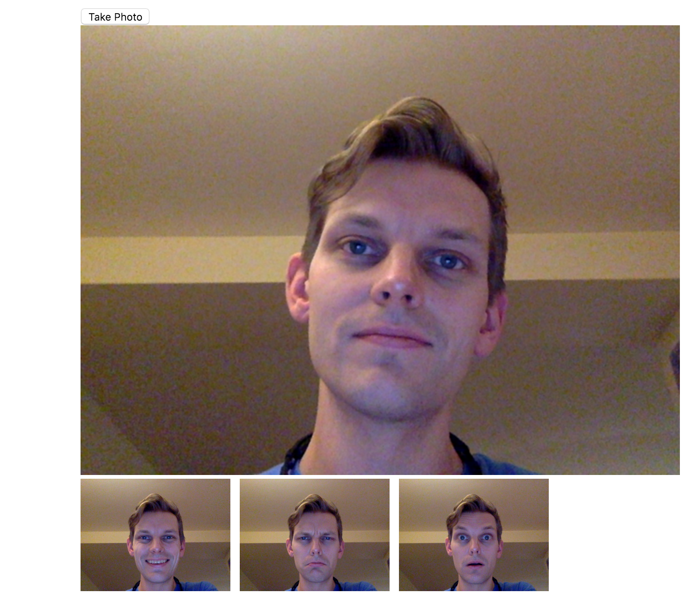

SelfieUi
========

Playing around with WebRTC to make a simple game, based on taking selfies!

You can take photos of yourself:

## Development
Please see [DEVELOPMENT](DEVELOPMENT.md)

## Boilerplate
This is starter react component generated using [generator-formidable-react-component](https://github.com/FormidableLabs/generator-formidable-react-component)
